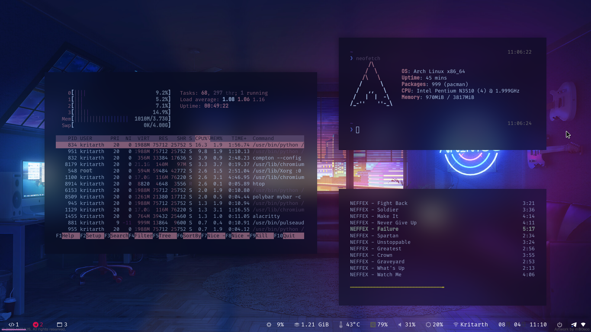

# KodyK's Dotfiles 

## i3-gaps + Polybar + Alacritty + ncmpcpp + htop + zsh

### Credits 
* [Aeres-u99](https://github.com/Aeres-u99) for Compton.
* Polybar inspired from [Ashpex](https://github.com/Ashpex)

## bspwm + Polybar + urxvt + Neovim + ranger 

### Credits 
* [Siduck](https://github.com/siduck76) for Neovim. Also, most of the stuff is inspired from his old bspwm rice.

